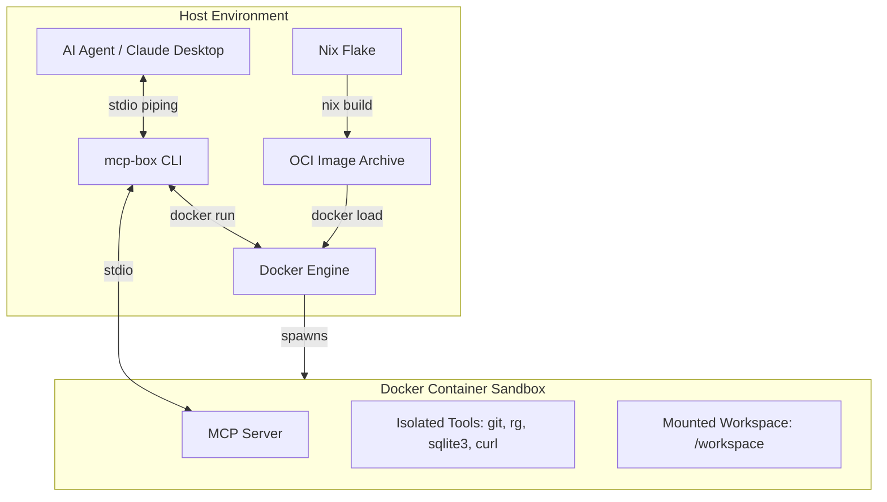

# mcp-box

**mcp-box** provides turnkey, immutable, and highly-isolated Linux container environments optimized specifically for Model Context Protocol (MCP) servers. By coupling **Nix**'s deterministic building engine with **Docker**'s isolation policies, `mcp-box` completely sandboxes AI agent tool execution, keeping your host system, configurations, and private keys entirely safe from unauthorized access, accidental changes, or malicious exploits.

---

## Key Features

1. **Strict Sandboxing**:
   - **Immutable Root (`--read-only`)**: The entire root filesystem is mounted read-only.
   - **Transient State (`--tmpfs`)**: Writable spaces (`/tmp` and `/run`) exist solely in RAM and disappear once the container stops.
   - **Zero Capabilities (`--cap-drop=ALL`)**: The running processes have no special Linux kernel capabilities.
   - **No Privilege Escalation (`no-new-privileges:true`)**: Prevents elevation to root inside the sandbox.
   - **Strict Network Policies (`--network none`)**: Servers like `sqlite`, `shell`, and `filesystem` have absolutely zero internet access by default.
   - **Scoped Workspaces**: Only specifically mounted host directories (`--workspace`) are visible to the server at `/workspace`.
2. **Correct File Ownership**:
   - Containers run mapped to your host UID/GID (`-u $(id -u):$(id -g)`), ensuring that files written to mounted workspaces are owned by you (not `root`) and don't trigger host-side permission errors.
3. **Painless Integration**:
   - Built-in configuration generator (`mcp-box config <server>`) prints out paste-ready JSON snippets to plug directly into `claude_desktop_config.json` or OpenClaw configurations.
4. **Hands-off Setup**:
   - Running a container automatically triggers Nix to build and load the OCI image if it's not already cached inside Docker.

---

## Architecture



---

## Pre-Packaged Sandboxes

| Server Name | Language | Included Utilities | Network Mode | Primary Purpose |
| :--- | :--- | :--- | :--- | :--- |
| **`sqlite`** | Python | `sqlite3` CLI, `fastmcp` SDK | `none` | High-performance, isolated database querying. |
| **`shell`** | Python | `bash`, `ripgrep`, `fd`, `git`, `curl`, `jq`, `sqlite`, `tar` | `none` | Safe, sandboxed script running and file operations. |
| **`filesystem`** | Node.js | `ripgrep`, `fd`, `git` | `none` | Scoped filesystem read/write and code searching. |
| **`fetch`** | Node.js | `curl` | `bridge` | Safe, isolated web fetching and scraping. |

---

## Usage Guide

### 1. Show Help & Supported Servers
```bash
./mcp-box help
./mcp-box list
```

### 2. Run a Sandbox Interactively
You can launch any server interactively to test its behavior and tools:
```bash
./mcp-box run sqlite --workspace /tmp/sandbox-db -- --db /workspace/test.db
```

### 3. Build/Force-Update an OCI Image
If you want to manually rebuild or force-update a Nix-built image:
```bash
./mcp-box build sqlite
```

### 4. Integration with AI Clients
To hook `mcp-box` into an AI client like Claude Desktop, generate the JSON config snippet:
```bash
./mcp-box config sqlite
```
Copy the printed snippet and add it to your configuration file (typically `~/.config/Claude/claude_desktop_config.json`).

---

## Security Audit Checks

To verify that your sandbox is indeed perfectly secure and isolated:

1. **Check Read-Only Filesystem**:
   ```bash
   ./mcp-box run shell --workspace /tmp/test-space -- --tool run_command "touch /etc/naughty"
   # Output should fail: "touch: cannot touch '/etc/naughty': Read-only file system"
   ```
2. **Check Network Isolation**:
   ```bash
   ./mcp-box run shell --workspace /tmp/test-space -- --tool run_command "curl -I https://google.com"
   # Output should fail due to network resolution issues.
   ```
3. **Check Privilege Escalation Block**:
   ```bash
   ./mcp-box run shell --workspace /tmp/test-space -- --tool run_command "sudo -l"
   # Output should fail: "sudo: command not found" or "sudo: must be setuid root"
   ```
